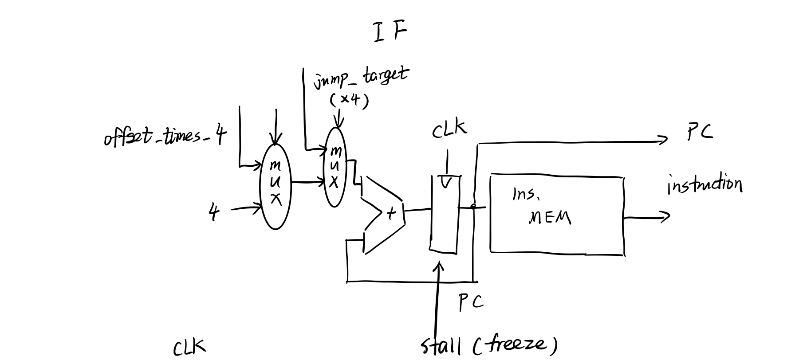

### Purpose

---

Design and implement a pipelined cpu with full support for hazard procession using stall (for load) and forwarding.

### **Method and Design**

---

The CPU has following parts:

	1. IF, instruction fetch, including PC adder, branch offset selector, and jump target assigner.
 	2. IF-to-ID register. For implementing pipeline.
 	3. ID, instruction decode, including register file read / write (control signals from WB stage), ALU control signal generator, branch predictor, jump target selector (feed to IF stage), and forward receivers for branch prediction sources.
 	4. ID-to-EX register. Same as above.
 	5. EX, execute, mainly including ALU and selector for forwarding sources.
 	6. EX-to-MEM register.
 	7. MEM, memory, including memory read / write.
 	8. MEM-to-WB register.
 	9. WB, write back, include selector for memory out and ALU result. 

Flow chats of some vital components are listed below. Note that the forwarding parts (this CPU has two forward units, one for branch prediction, the other for normal ALU source selection) are not shown due to the length constraints.

#### IF stage



​	Above is the IF part. In addition to the normal components like mux for branch offset,  an extra selector is added for selecting jump targets given by `ID`. The `PC` register also receives an extra freeze signal for handling load stall.

##### IF/ID pipeline register


​	Then the pipeline register. The following pipeline registers are of similar structure so they will not be shown.

#### ID stage

##### Register file & branch source 


​	The main part for `ID`. Different from other simple pipelined CPU, an extra forward handling part is added for `ID` to achieve solving stalls caused by branch. `br_a1` and `br_a2` are the actual branch condition value (`rs`, `rt` of `bne` or `beq`). The principle of getting their value is similar to the forwarding in conventional `EX` part for selecting ALU source. The implementation of generating `br_a1_sel` and `br_a2_sel` (named `forward2`) is also in `forward.v` file together with the forwarding unit (`forward`) used by ALU src. The difference is the forwarding for branch prediction has four possible forwarding source since branch prediction must be finished within `ID` stage, which makes it impossible for waiting register write even if the needed data has already arrived `WB` stage. This design also helps in some extreme conditions like branch immediately after load with the access to load target.

##### Control unit


​	Next is the control part in `ID` stage. The control generates a lot of signals for branch prediction, jump target decision, hazard handling and forward handling. For example, `is_branch` is used in creating extra stall for load when the next instruction is right the branch instructions with access to the load target. Without that signal, branch will not fetch the right value for prediction since one of its register requires the data fetched by load instruction.

##### ALU data


​	Next is the ALU data selection and data source / target selector. This part has little difference than the conventional simple pipelined CPU. Only note that there is an extra mux for selecting `PC+4` when the instruction is `jal` since it will store the address of next instruction to `$ra`. So correspondingly, extra id for `$ra` is  added to  the data target selector (`reg_dest`).

##### load hazard


​	The hazard handling part. As mentioned above, it will generate an extra stall for branch-after-load for setting down the data. Apart from that it is a normal stall generator for solving possible data hazard when load instruction is executed.

#### EX stage


​	Then the EX part. Conventional design, with three selector for selecting forwarded data source. The selecting signal is generated by `forward` module in `forward.v`. Note that module `forward2` is only for branch prediction in ID stage.

#### MEM and WB stage


Last is the MEM part and WB part. Conventional design with no special point.

### Compile & Run

---

This project has `makefile`. Before compiling, make sure that you have installed `iverilog`. 

Change working directory to the source folder, then execute:

````shell
$ make
````

then file `cpu` should under that directory. Once invoked, it will automatically read the `instruction.bin` file under the same directory for instruction loading. The max instruction is 512 (word), which is defined in file `constants.v` (constant `INS_SIZE`) together with `MEM_SIZE`, the max size of memory. Unit in word. If necessary you can freely change it and recompile for taking effect.

When the CPU encounters the `32'hffffffff` instruction, it will wait for the last instruction to finish and then write the memory image to file `memfile.s` under the same directory. The file path is defined in `dataMEM.v` and you can also change it.  By default it prints in hex. So make sure that your instructions are terminated by `32'hffffffff`.

This CPU is fixed to execute no longer than 5000 clocks, which is defined in `cpu.v` and controlled by the clock generator (only 5000 cycles). It is set to avoid possible infinite loops, and can be changed to infinite if you want to run the CPU as long as possible.


